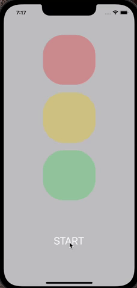

# TrafficLights
## Учебный проэкт
На экране расположены view представляющие из себя сфетофор, и кнопка взаимодействия с ними , при первом запуске на кнопке отображается надпись Start.
При нажатии на кнопку надпись на ней меняется на Next , а сигналы сфетофора начинают меняться при каждом следующем нажатии.

## Educational project
On the screen there are views representing a traffic light, and a button for interacting with them, at the first start, the inscription Start is displayed on the button.
When you press the button, the inscription on it changes to Next, and the traffic light signals begin to change with each next press.

